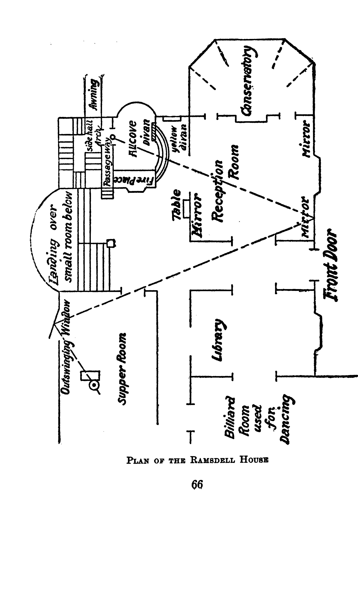
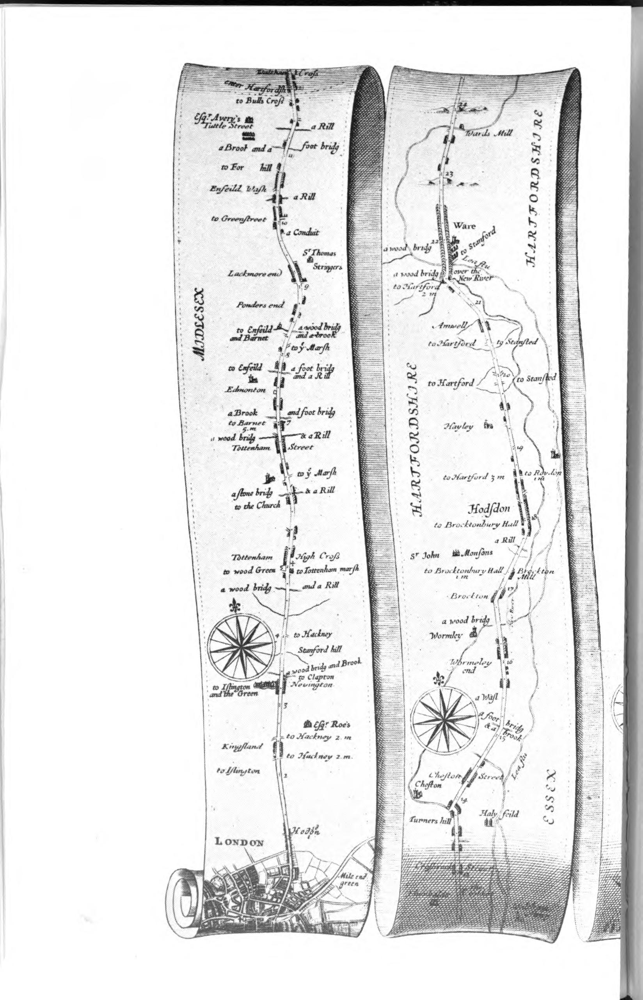
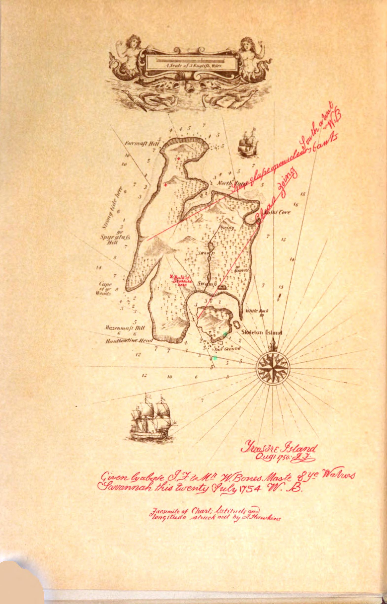

# maps-from-fiction
## Data Repository for Castles, Battlefields, and Continents: A Dataset of Maps from Literature

The final dataset download includes:
- jpg files for 2622 identified maps
- csv file of map filenames
- csv file of MARC record data for all novels and for map-novels
- finetuned EfficientNet models (b0, b7, and V2_L) and classification outputs for each model
- results from the CLIP model
- the sample of non-map-novels used for spatial language comparison

This dataset can be downloaded [here]([https://doi.org/10.7298/3zd0-ks10](https://ecommons.cornell.edu/items/6d470f13-bac5-4b0e-94f2-4eac93d677cb))

Relevant code will be uploaded to this repository soon. In the meantime, email Axel at adb333 [at] cornell.edu for code or for any questions about the paper.

Please cite this paper if you use any portion of the dataset:
```bibtex
@article{10.63744@oYbvYsUA743D,
  title = {Castles, Battlefields, and Continents: A Dataset of Maps from Literature},
  author = {Axel Bax and David Mimno and Matthew Wilkens},
  year = {2025},
  journal = {Anthology of Computers and the Humanities},
  volume = {3},
  pages = {280--294},
  editor = {Taylor Arnold, Margherita Fantoli, and Ruben Ros},
  doi = {10.63744/oYbvYsUA743D}
}
```

We also include a tutorial for you to use the same workflow with your own dataset of images. You can find it unter `tutorials`.

*Note*: Two maps have been included in this dataset, but should be excluded: 32000002642652_00000033.jpg and 39015030849908_00000219.jpg
These maps contain cartoons with a map in them, one of the edge cases we chose to exclude.


Here are a few interesting maps from the dataset:

*The Woman in the Alcove* by Anna Katharine Green



*Colonel Jack* by Daniel Defoe



*Treasure Island* by Robert Louis Stevenson


